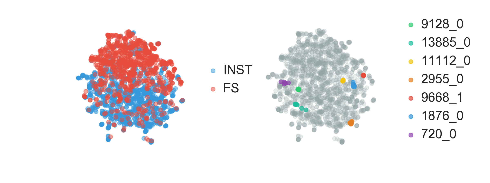

# Learning Similarity Metrics for Melody Retrieval

Similarity measures are indispensable in music information retrieval. In recent years,
various proposals have been made for measuring melodic similarity in symbolically encoded
scores. Many of these approaches are ultimately based on a dynamic programming approach
such as sequence alignment or edit distance, which has various drawbacks. First, the
similarity scores are not necessarily metrics and are not directly comparable. Second, the
algorithms are mostly first-order and of quadratic time-complexity, and finally, the
features and weights need to be defined precisely. 



We propose an alternative approach
which employs deep neural networks for end-to-end similarity metric learning. We contrast
and compare different recurrent neural architectures (LSTM and GRU) for representing
symbolic melodies as continuous vectors, and demonstrate how duplet and triplet loss
functions can be employed to learn compact distributional representations of symbolic
music in an induced melody space. We contrast this approach with an alignment-based
approach. We present results for the Meertens Tune Collections, which consists of a large
number of vocal and instrumental monophonic pieces from Dutch musical sources, spanning
five centuries, and we demonstrate the robustness of the learned similarity metrics.

#### [Full paper](); [Supplementary material](https://github.com/fbkarsdorp/melodic-similarity/blob/master/Karsdorp_ISMIR2019_SI.pdf)

## Citation

When using the code, or data associated with this paper and repository, please cite:

Karsdorp F, Van Kranenburg P & Manjavacas E. “Learning Similarity Metrics for Melody
Retrieval”, 20th International Society for Music Information Retrieval Conference, Delft,
The Netherlands, 2019. 

``` bibtex
@inProceedings{karsdorp_learning_melody_sims,
  author    = {Folgert Karsdorp and Peter {Van Kranenburg} and Enrique Manjavacas},
  title     = {Learning Similarity Metrics for Melody Retrieval},
  booktitle = {20th International Society for Music Information Retrieval Conference},
  address   = {Delft, The Netherlands},
  year      = {2019}
}
```

## Requirements

The code requires Python version 3.6 or higher. All dependencies are listed in
`requirements.txt` and can be installed by running the following command in your shell:

``` bash
pip install -r requirements.txt
```

## Training

The script `train.py` can be used for training. The script provides many different
options, which can be accessed using:

``` bash
python train.py --help
```

A typical training run is done using something like:

``` bash
python train.py --train ../data/datasets/FSINST_train.jsonl \
  --dev ../data/datasets/FSINST_dev.jsonl --test ../data/datasets/FSINST_test.jsonl \
  --categorical_features scaledegree pitch metriccontour imacontour \
  --continuous_features duration beat beatstrength imaweight phrasepos \
  --example_type pairs --n_classes 5 \
  --n_samples 5 --n_layers 2 --model LSTM --emb_dim 8 --hid_dim 64 --dropout 0.5 \
  --loss cosine --margin 0.4 --weight 0.25 --lr 0.001 --batch_size 20 \
  --log_interval 10 --n_workers 5 --cuda --early_stop_score MAP --balanced_batch_sampler \
  --online_sampler --patience 10 --scaler zscore 
```

## License

Karsdorp, Van Kranenburg, Manjavacas.  Licensed under a Creative Commons Attribution 4.0
International License (CC BY 4.0). Attribution: Karsdorp, Van Kranenburg,
Manjavacas. “Learning Similarity Metrics for Melody Retrieval”, 20th International Society
for Music Information Retrieval Conference, Delft, The Netherlands, 2019
